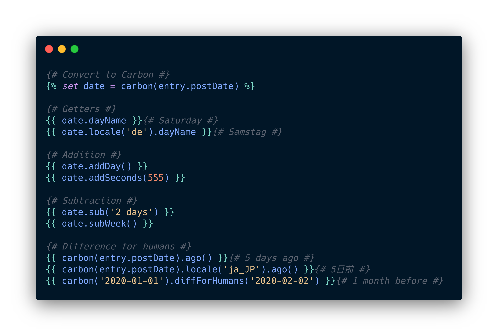

# Carbon

Provides access to Carbon in Craft templates.



## Usage

This plugin simply converts a date or string into a Carbon instance.

See the [Carbon docs](https://carbon.nesbot.com/docs/) for all the methods available.

#### Converting

This plugin provides a function, a filter, and a variable for converting dates into Carbon instances.

```twig
{# As a function #}



{# As a filter #}



{# As a variable #}


```

#### Examples

```twig
{# Getters #}
{{ date.dayName }}{# Saturday #}
{{ date.locale('de').dayName }}{# Samstag #}

{# Addition #}
{{ date.addDay() }}
{{ date.addSeconds(555) }}

{# Subtraction #}
{{ date.sub('2 days') }}
{{ date.subWeek() }}

{# Difference for humans #}
{{ carbon(entry.postDate).ago() }}{# 5 days ago #}
{{ carbon(entry.postDate).locale('ja_JP').ago() }}{# 5日前 #}
{{ carbon('2020-01-01').diffForHumans('2020-02-02') }}{# 1 month before #} 
```
